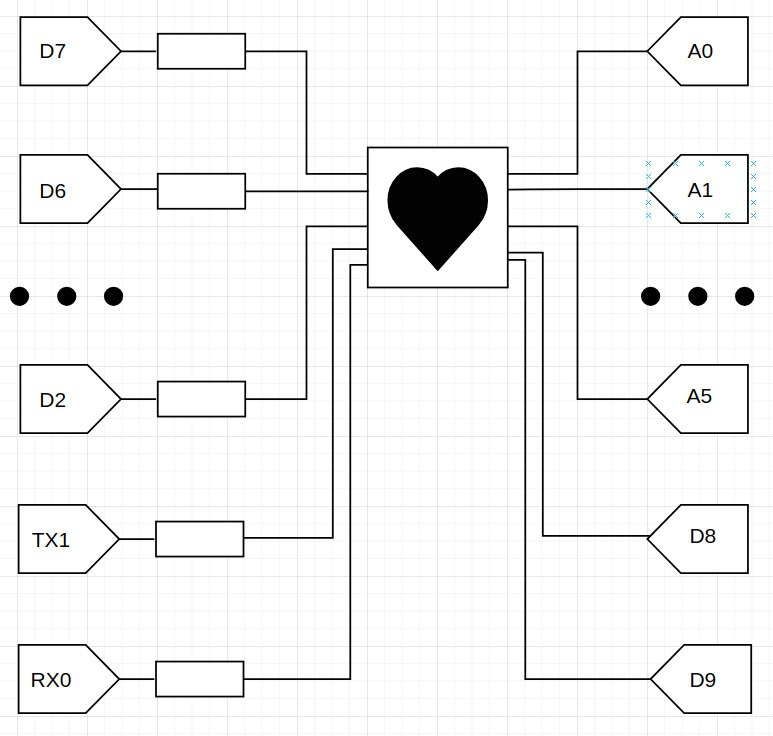

Данное приложение сделано для вывода картинки сердчека на светодиодную матрицу 8x8 (1088AS) с помощью регистров.

Ссылка на демонстрацию работы -
https://drive.google.com/file/d/1yOwVmAU8zbNjjFNHRdgnIxTrt6AAsQAR/view?usp=drivesdk

