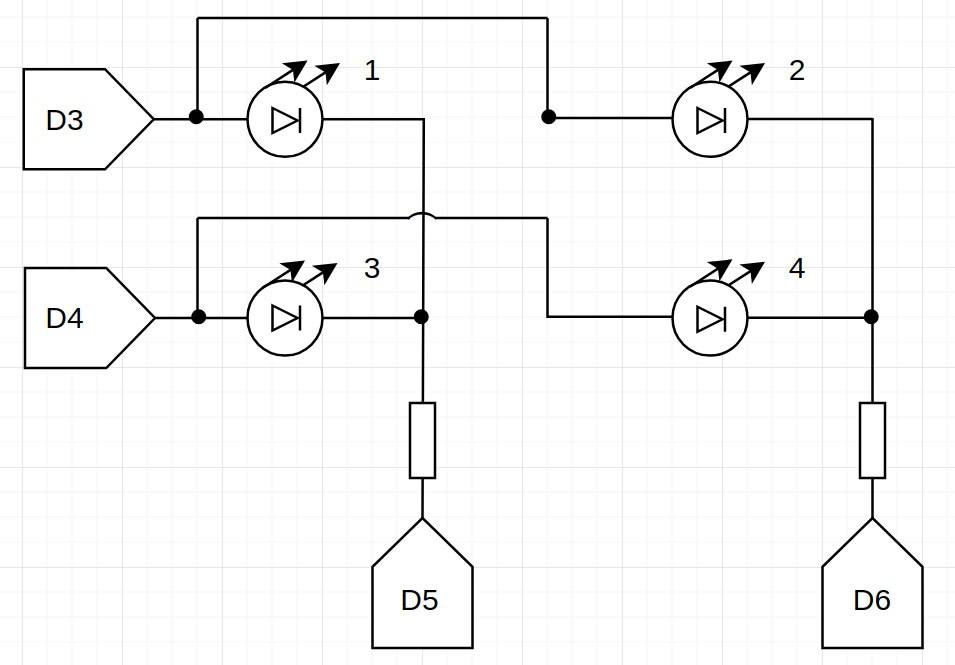

Данное приложение - реализация квадрата из светодиодов 2x2 с использованием ШИМ(PWM) для сокращения числа подключений и резисторов. В этом приложении перебираются все возможные варианты включения светодиодов с интервалом 2 секунды.

ссылка на демонстрацию работы -

https://drive.google.com/file/d/1l12jgvl6B9EPMxaL2x5Kzg9eJ-dqpXsu

