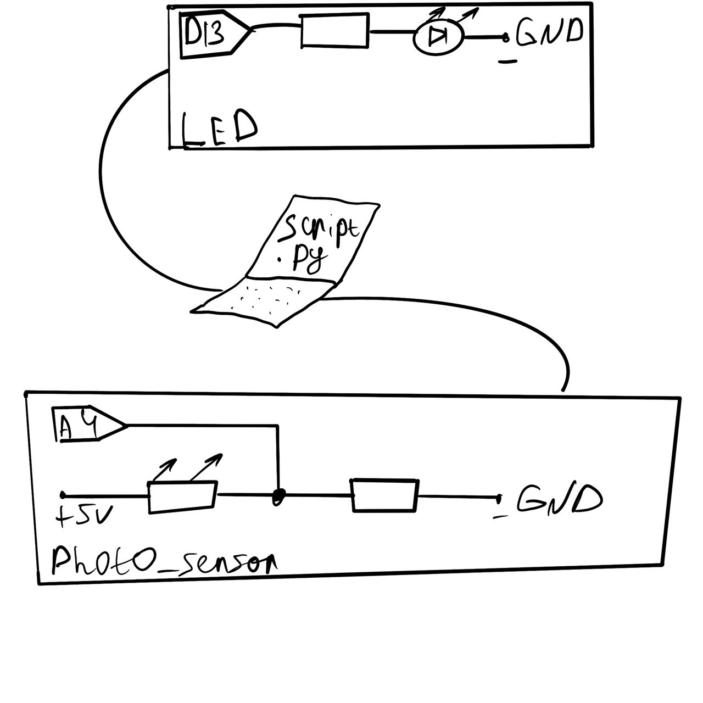

Данное приложение разработано для управления двумя разными микроконтроллерами с одного компьютера. Когда на светочувствительный сенсор падает достаточно света, то лампочка на другом микроконтроллере начинает светиться

ссылка на демонстрацию работы:

https://drive.google.com/file/d/1pWfcJ25hFYx4lPsMYX7FXjhQaGelCm4-/view?usp=drivesdk

