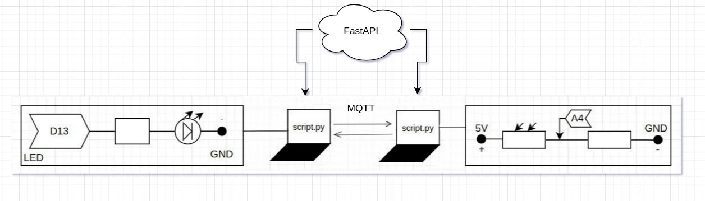

Данное приложение разработано для управления двумя разными микроконтроллерами с двух компьютеров. Когда на светочувствительный сенсор падает достаточно света, то лампочка на другом микроконтроллере начинает светиться. Также реализовано несколько потоков данных на разных роутах с помощью mqtt. Выдача ID сделана при помощи FastAPI.

ссылка на демонстрацию работы:

https://drive.google.com/file/d/1laJKBOXu-Ptr0yPrvH3jEWvxXInnjrLF/view?usp=drivesdk

