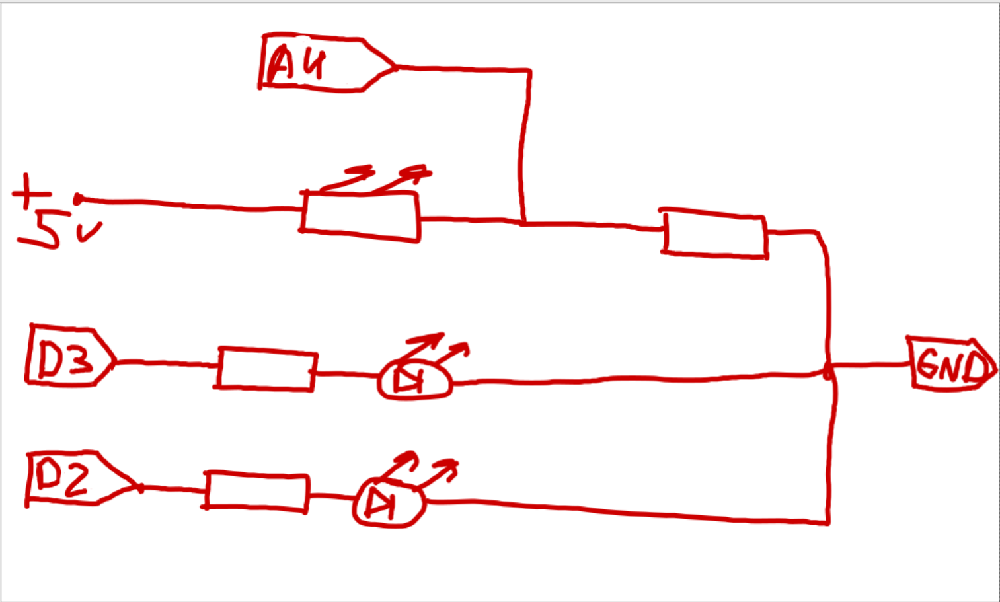

Данное приложение разработано для определения направления источника света. Для работы нужно просто загрузить программу, на видео светодиоды расположены таким образом, что правый указывает на правую сторону, а левый - на левую, так проще ориентироваться.

ссылка на демонстрацию работы:

https://drive.google.com/file/d/13dpyS4Hyk3hqXwcbz7xc0Ga0SZQ-24rr/view?usp=drive_link

